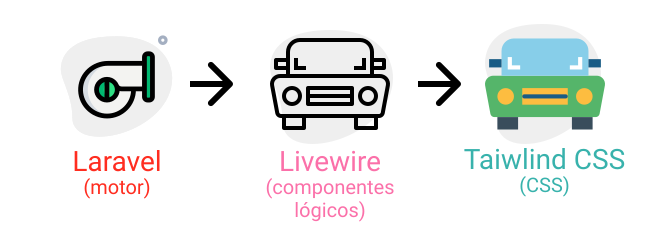

<p align="center">

</p>
<h1 align="center">
    Bookcase
</h1>

<p align="center"> 
📖 Estudo dirigido aos frameworks Laravel,
Livewire e Tailwind CSS
</p>

<p align="center" style="margin-bottom:50px;">
 <a href="#🏁Sobre">Sobre</a> •
 <a href="#🧰Instalação">Instalacao</a> • 
 <a href="#✅tecnologias">Tecnologias</a> • 
 <a href="#📄como-usar">Como usar</a> •
 <a href="#features">Features</a> 
</p>

<p align="center">


</p>


### 🏁Sobre

Bookcase ou estante de livros é um sistema para registros onde o usuário cadastra os livros de sua prateleira física em uma estante virtual para nunca mais esquecer e assim poder compartilhar sua lista de livros com seus amigos!

O modelo arquitetural escolhido para o projeto foi o MVC pois o Laravel já oferece uma dinâmica ampla e bastante relevante para criar projetos neste modelo, além disso, oferece recursos por linha de comando que facilita e agiliza o desenvolvimento do projeto. Utilizei o Livewire para criação de componentes lógicos, o que me dá autonomia para reutilização daquele componente em outros sistemas. Algumas vantagens de usar o Livewire é sua reatividade e a possibilidade de “brincar” com Javascript sem sair do lugar além da interação com o PHP ser muito simples, e como vender um carro se somente se tem a carcaça?
O Front-end foi desenvolvido de modo bem simples somente para a apresentação das partes de um CRUD com isso entra o Tailwind CSS, o framework baseia-se em atomic design e dá uma flexibilidade em componentes complexos. 


<p align="center">
    
</p>

### 🧰Instalação

#### 🚧 Alguns pré-requisitos 🚧
É necessário que você tenha um servidor e um banco de dados SQL para facilitar o processo.
Recomendo utilizar Xampp e o SGBD phpmysql

#### 🚀 Go 🚀
Utilize esse comando para clonar o repositório:
```GIT
git clone https://github.com/gdk46/bookcase.git
```
ou baixe clicando [aqui](https://github.com/gdk46/bookcase/archive/master.zip).

Acesse ao diretório e digite os comandos para baixar as dependêcias:
```
Acessando o diretório:
cd bookcase

Baixar as dependêcias Windows:
composer install && npm install

Linux:
composer install ; nvm install
```

### ✅Tecnologias

* [PHP](https://www.php.net/) version: 7.4.* 
* [Laravel](https://laravel.com/) version: 8.12 
* [Livewire](https://laravel-livewire.com/) version: 2.4
* [Tailwind CSS](https://tailwindcss.com/) version: 2.0.3
* [Slick carousel](https://kenwheeler.github.io/slick/) version: 1.8.1 
* [NPM](https://www.npmjs.com/) version: 6.14.11 
* HTML
* CSS3
* SQL


### 📄Como usar
 - ainda documentando

### Features

- [x] Cadastro de livro
- [x] Edição de livro
- [x] exclusão de livro
- [x] Listagem de livro
